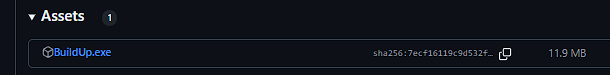

  

<h1 align="center">LunaUx Decompiler</h1>

LunaUx Is a 100% safe decompiler fully coded in python, which guarantees a safe and efficient decompilation, it also provides other methods of disassemble or AST generation ([Abstract Syntax Tree](https://en.wikipedia.org/wiki/Abstract_syntax_tree)) In Luau

> Only For Luau Versions higher than 4 and lower than 6

> Join to our [LunaUx Decompiler discord](https://discord.gg/2mJUD4XDDT) server for being noticed from new changes and releases.

> **Note**: This project is distributed under the terms of the GNU General Public License version 3.0 (GPL v3.0). By using, modifying, or distributing this software, you agree to comply with the conditions set forth in this license, which aims to ensure freedom, openness, and the protection of users’ rights.

## Credits
- **boydev1444**
  - **Github**: [boydev1444](https://github.com/boydev-1444)
  - **Discord**: @boydev1444 (1091484248650829905)
  - **Role**: Writed Decompiler / Dissasembler / AST Generator

## Build-up

> Visit the [**repository releases page**](https://github.com/boydev-1444/LunaUx-Decompiler/releases) and locate the latest release of the project. Within this release, you will find an executable file named "**build-up.exe**" available for download.

  

